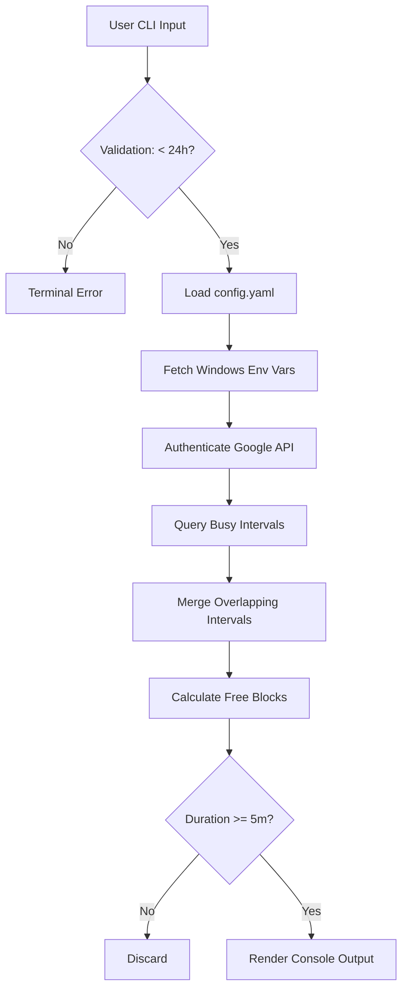

# 1. ARCHITECTURE OVERVIEW

The system is a local command-line interface (CLI) utility designed to calculate consolidated availability across multiple Google Calendars within a user-defined window. The architecture follows a linear pipe-and-filter pattern: **Input Validation $\rightarrow$ Data Retrieval $\rightarrow$ Interval Processing $\rightarrow$ Output Generation**.

### Core Logic: Interval Merging and Gap Analysis

* **Consolidation**: The system retrieves all events marked as "busy" from the target calendars. It utilizes a sweep-line algorithm to merge overlapping or adjacent intervals into a single continuous timeline.
* **Gap Analysis**: Free time is calculated as the inverse of the merged busy intervals within the requested window.
* **Filtering**: Any identified free block with a duration $\Delta t < 5$ minutes is discarded to ensure schedule quality.

### System Flow Diagram



---

# 2. TECH STACK

Based on the requirement for a minimalist local tool and Windows-specific environment variable management:

* **Language**: **Python 3.10+** (utilizing type hints for maintainability).
* **Google Integration**:
* `google-api-python-client`: Official library for Calendar API v3.
* `google-auth-oauthlib`: Handling OAuth 2.0 flows.


* **Data Handling**:
* `PyYAML`: For parsing the local configuration file.
* `python-dateutil`: For robust datetime parsing and timezone handling.


* **CLI Interface**:
* `argparse`: Standard library for handling `--start` and `--end` flags.


---

# 3. DATA SCHEMA

### A. Local Configuration (`config.yaml`)

The system identifies target calendars through this YAML structure:

```yaml
calendars:
  - id: "primary"
  - id: "engineering@group.calendar.google.com"
  - id: "personal@gmail.com"

```

### B. Windows Environment Variables

To keep credentials secure and outside the codebase, the system retrieves the following from the Windows User Environment:

* `GOOGLE_CLIENT_ID`: OAuth 2.0 Client ID.
* `GOOGLE_CLIENT_SECRET`: OAuth 2.0 Client Secret.
* `GOOGLE_REFRESH_TOKEN`: Persistent token used to generate new access tokens without manual re-login.

### C. Internal Data Objects

* **BusyInterval**: `(start: datetime, end: datetime)`
* **FreeBlock**: `(start: datetime, end: datetime, duration: timedelta)`

---

# 4. FOLDER STRUCTURE

The project is organized to separate API communication from the core interval-merging logic:

```text
calendar-consolidator/
├── .env.example              # Reference for required environment variables
├── .gitignore                # Excludes __pycache__, local tokens, and venv
├── config.yaml               # User-defined Calendar IDs
├── requirements.txt          # Python dependencies
├── README.md                 # Setup and usage instructions
└── src/
    ├── __init__.py
    ├── main.py               # CLI entry point and orchestration
    ├── auth.py               # Windows Env Var retrieval and OAuth refresh
    ├── calendar_service.py   # Google API wrappers (Free/Busy queries)
    ├── processor.py          # Merging algorithm and gap calculation
    └── utils.py              # Time formatting and duration validation

```

---

# 5. DEPLOYMENT & ENVIRONMENT

### A. Setting Environment Variables in Windows

The user must configure the environment variables via PowerShell to ensure they are available to the script:

```powershell
# Set credentials at the User level
[System.Environment]::SetEnvironmentVariable('GOOGLE_CLIENT_ID', 'your_id_here', 'User')
[System.Environment]::SetEnvironmentVariable('GOOGLE_CLIENT_SECRET', 'your_secret_here', 'User')
[System.Environment]::SetEnvironmentVariable('GOOGLE_REFRESH_TOKEN', 'your_token_here', 'User')

```

### B. Timezone Handling

The system defaults to the local system timezone for all inputs and outputs. Datetimes from the Google API are converted to the local zone before the merging process begins.

### C. Validation & Constraints

* **Input Window**: If `start >= end` or the duration exceeds 24 hours, the system aborts with a validation error.
* **Error Handling**: Invalid or inaccessible Calendar IDs are logged as warnings, allowing the script to continue with valid calendars.
* **Accuracy**: Results are reported with minute-level precision.

### D. Execution Example

```bash
python src/main.py --start "2026-05-07 09:00" --end "2026-05-07 18:00"

```
